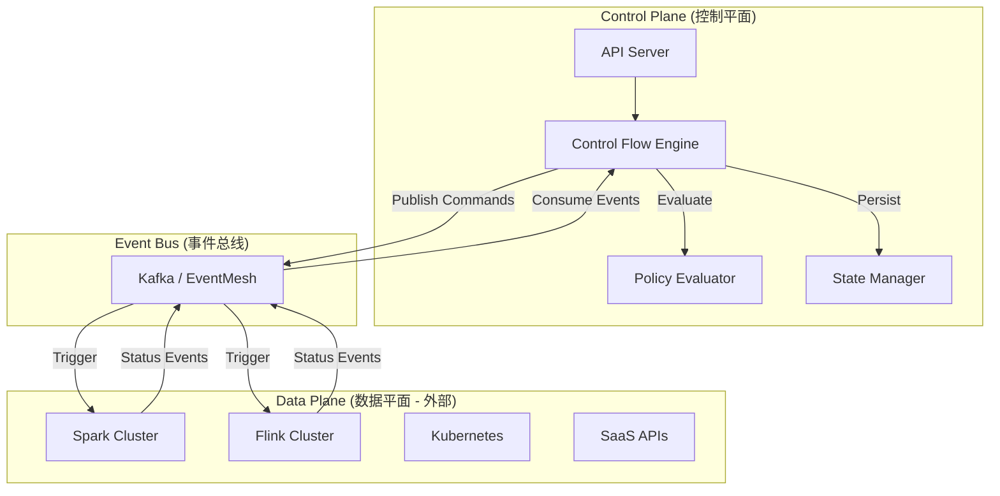

# 架构总览

**ControlFlow** 采用分层架构设计，核心围绕 **事件驱动 (Event-Driven)** 和 **反应式控制 (Reactive Control)** 构建。

## 1. 核心架构图

## 2. 核心组件

### 2.1 Control Plane (控制平面)

系统的"大脑"，负责决策和调度。

*   **Control Flow Engine**: 核心引擎，负责监听事件流，根据 Pipeline 定义和 Node 状态机进行状态流转。
*   **Policy Evaluator**: 策略评估器，基于 SpEL (Spring Expression Language) 动态评估节点的 `startWhen`, `stopWhen`, `retryWhen` 等控制策略。
*   **State Manager**: 状态管理器，维护 Pipeline 和 Node 的运行时状态（Pending, Running, Succeeded, Failed）。

### 2.2 Event Bus (事件总线)

系统的"神经系统"，负责组件间的异步通信。

*   **CloudEvents**: 所有消息遵循 CloudEvents 规范。
*   **Topics**:
    *   `control.commands`: 引擎发出的控制指令 (Start, Stop)。
    *   `task.events`: 任务执行器上报的状态变更 (Started, Succeeded, Failed)。

### 2.3 Task Executors (任务执行器)

实际执行任务的组件（通常是外部系统）。ControlFlow 不直接执行业务逻辑，而是通过 **Adapter** 与外部系统交互。

*   **TaskSchema**: 定义了如何与特定执行器交互的协议 (HTTP, gRPC, CRD)。
*   **Adapters**: 负责将 ControlFlow 的标准指令转换为外部系统的具体调用。

## 3. 关键设计模式

### 3.1 Reactive Control (反应式控制)

传统工作流引擎通常是 **Proactive (主动调度)** 的：引擎计算 DAG，按顺序提交任务。
ControlFlow 是 **Reactive (反应式)** 的：
1.  引擎不"推"任务，而是"响应"事件。
2.  每个 Node 独立订阅感兴趣的事件 (`startWhen`)。
3.  当条件满足时，Node 自主触发。

### 3.2 Hybrid Orchestration (混合编排)

通过统一的事件模型，消除了 Batch 和 Streaming 的编排边界：
*   **Batch**: 产生离散的 `Succeeded` / `Failed` 事件。
*   **Streaming**: 产生持续的 `Metrics` / `Status` 事件。
*   **ControlPolicy**: 允许 Batch 任务订阅 Streaming 状态（如"当流任务积压 > 1000 时触发批处理扩容"），反之亦然。

## 4. 数据流 vs 控制流

*   **Control Flow**: 也就是本系统管理的范畴。包括任务的启动、停止、重试、跳过、依赖判断。
*   **Data Flow**: 实际的数据传输。由 Spark/Flink/Kafka 等组件在数据平面完成。本系统仅在 Payload 中传递数据的**引用** (Reference)，如 S3 路径、Kafka Topic 名。
