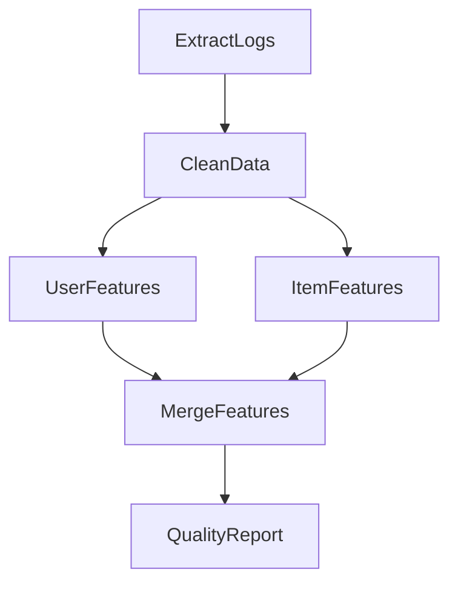

# 场景 1：批量特征工程

## 1. 场景描述
**目标**: 每周基于历史数据生成训练特征。
**特点**: 典型的大数据批处理 DAG，包含并行计算和汇聚依赖。

## 2. 编排拓扑 (DAG)

## 3. 任务定义 (Task Definitions)

本场景主要使用 **PySparkOperator**。

| 节点 ID | 任务类型 | 关键配置 (TaskDefinition) | 依赖 (Dependencies) |
| :--- | :--- | :--- | :--- |
| **ExtractLogs** | `pyspark_batch` | `script: extract.py`, `args: {date}` | - |
| **CleanData** | `pyspark_batch` | `script: clean.py` | ExtractLogs |
| **UserFeatures** | `pyspark_batch` | `script: user_feat.py`, `resources: {cpu: 10}` | CleanData |
| **ItemFeatures** | `pyspark_batch` | `script: item_feat.py`, `resources: {cpu: 4}` | CleanData |
| **MergeFeatures** | `pyspark_batch` | `script: merge.py` | UserFeatures, ItemFeatures |
| **QualityReport** | `pyspark_batch` | `script: report.py` | MergeFeatures |

## 4. ControlFlow 需求分析

1.  **并行执行**: `UserFeatures` 和 `ItemFeatures` 需同时调度以节省时间。
2.  **依赖等待**: `MergeFeatures` 必须等待上游**所有**父节点成功后才能启动。
3.  **资源调度**: 不同节点需要不同的资源配额（如 UserFeatures 需要更多 CPU）。
4.  **变量传递**: 根节点传入 `date` 参数，需透传给所有子节点。
