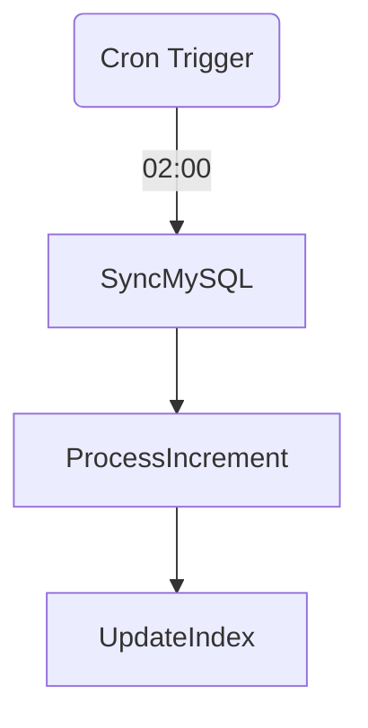

# 场景 2：增量数据处理

## 1. 场景描述
**目标**: 每天凌晨 02:00 处理前一天的数据。
**特点**: 周期性调度 (Scheduled)，强依赖时间分区变量。

## 2. 编排拓扑

## 3. 任务定义

| 节点 ID              | 任务类型        | 关键配置                                               |
| :------------------- | :-------------- | :----------------------------------------------------- |
| **SyncMySQL**        | `sql_query`     | `query: SELECT * FROM orders WHERE dt = '{yesterday}'` |
| **ProcessIncrement** | `pyspark_batch` | `args: {date: '{yesterday}'}`                          |
| **UpdateIndex**      | `http_request`  | `url: /api/refresh_index`                              |

## 4. ControlFlow 需求分析

1.  **时间变量注入**:
    *   系统需自动计算 `execution_date` (e.g., 2025-12-10) 并注入到 `{yesterday}` 变量中。

2.  **补数 (Backfill)**:
    *   支持手动触发历史区间的运行（如重跑 12-01 到 12-05 的任务）。
    *   ControlFlow 需依次生成 5 个 DAG 实例。

3.  **依赖检查**:
    *   支持 `Sensor` 机制：等待上游数据源（如 MySQL 分区）就绪后再启动任务。
