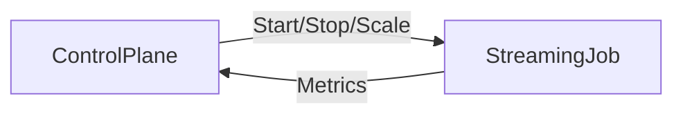

# 场景 3：流式数据清洗

## 1. 场景描述
**目标**: 7x24 小时实时清洗 Kafka 数据流并写入数据湖。
**特点**: 持续运行的任务，需要支持动态扩缩容和状态管理。

## 2. 编排拓扑

## 3. 任务定义 (Task Definitions)

本场景使用 **StreamingOperator** (Flink)。

| 节点 ID         | 任务类型          | 关键配置 (TaskDefinition)                          |
| :-------------- | :---------------- | :------------------------------------------------- |
| **RealtimeETL** | `flink_streaming` | `entryClass: com.example.EtlJob`, `parallelism: 4` |

## 4. ControlFlow 需求分析 (Reactive Control)

与批处理不同，流计算的核心在于**生命周期管理**：

1.  **启动 (Start)**:
    *   Action: `start`
    *   Control: 提交 Flink Job 到集群，记录 JobID。

2.  **弹性扩缩 (Scale)**:
    *   **场景**: 晚高峰流量突增，延迟升高。
    *   Action: `scale(parallelism=8)`
    *   Control: 触发 Savepoint -> 停止 Job -> 以新并行度重启。

3.  **版本升级 (Update)**:
    *   **场景**: 业务逻辑变更。
    *   Action: `restart(savepoint=true)`
    *   Control: 优雅停止并保存状态 -> 使用新 Jar 包从 Savepoint 恢复。

4.  **健康监控 (Monitor)**:
    *   Event: `metrics` (lag, throughput)
    *   Control: 收到高延迟报警 -> 自动触发 Scale Action。
