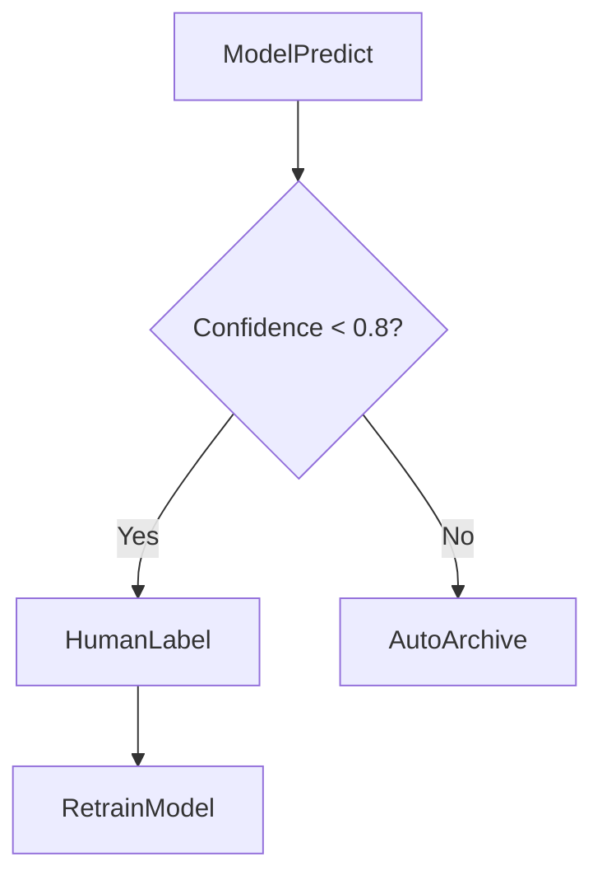

# 场景 4：数据标注工作流

## 1. 场景描述
**目标**: 筛选低置信度数据 -> 人工标注 -> 重新训练。
**特点**: 包含**人工审批/操作**节点，流程会长时间挂起（Long-running）。

## 2. 编排拓扑

## 3. 任务定义

| 节点 ID | 任务类型 | 关键配置 |
| :--- | :--- | :--- |
| **ModelPredict** | `ray_job` | `entrypoint: predict.py` |
| **HumanLabel** | `approval` | `approvers: [labeler_group]`, `timeout: 24h` |
| **RetrainModel** | `ray_job` | `entrypoint: train.py` |

## 4. ControlFlow 需求分析

1.  **条件分支 (Branching)**:
    *   根据 `ModelPredict` 的输出（Metrics）动态决定下游路径。

2.  **异步挂起 (Async Wait)**:
    *   `HumanLabel` 任务启动后，Worker 释放资源，DAG 状态保持 `RUNNING`。
    *   Control Plane 等待外部系统（标注平台）的回调事件。

3.  **超时处理 (Timeout)**:
    *   如果 24小时内未完成标注，触发 `timeout` 事件，自动流转到默认处理逻辑。
