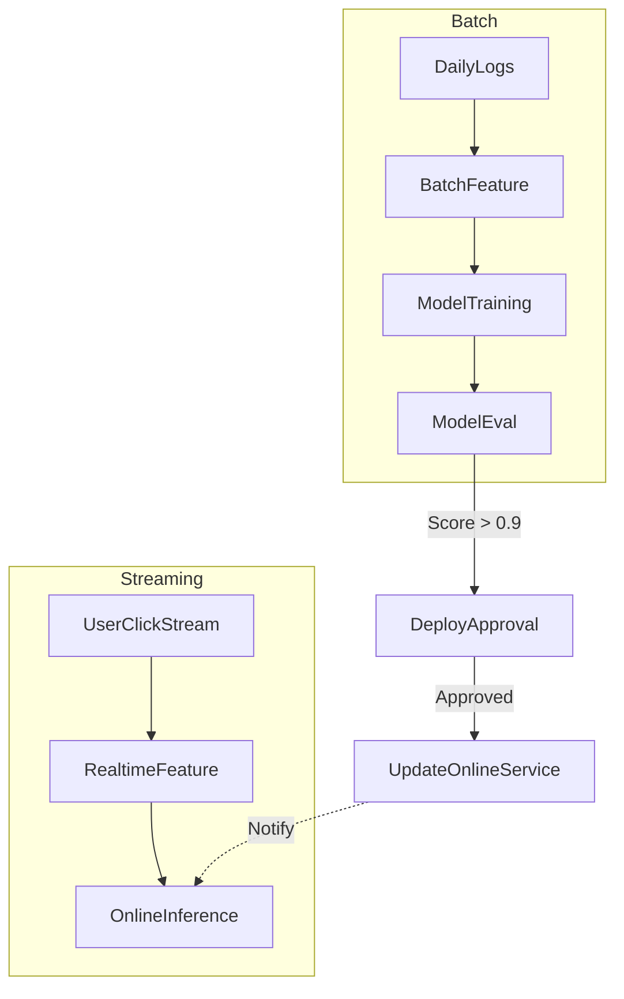

# 场景 5：用户行为分析与推荐 (流批一体)

## 1. 场景描述
**目标**: 实时推荐 + 离线模型更新。
**特点**: 复杂的混合编排，涉及流计算、批处理、模型训练和上线审批。

## 2. 编排拓扑

## 3. 任务定义

| 节点 ID | 任务类型 | 关键配置 |
| :--- | :--- | :--- |
| **UserClickStream** | `flink_streaming` | 持续运行 |
| **ModelTraining** | `ray_job` | 分布式训练 |
| **DeployApproval** | `approval` | 负责人审批 |
| **UpdateOnlineService** | `http_request` | 调用 K8s API 更新服务 |

## 4. ControlFlow 需求分析

1.  **跨模态依赖**:
    *   批处理流程（Batch）的输出（新模型）会触发流计算流程（Streaming）的更新。

2.  **事件触发 (Event Trigger)**:
    *   `UpdateOnlineService` 完成后，发送 `ModelUpdated` 事件。
    *   `OnlineInference` (Streaming Job) 监听该事件，自动加载新模型参数（无需重启）。

3.  **端到端血缘**:
    *   ControlFlow 需记录从 离线训练数据 -> 模型 -> 在线服务 的完整版本血缘。
