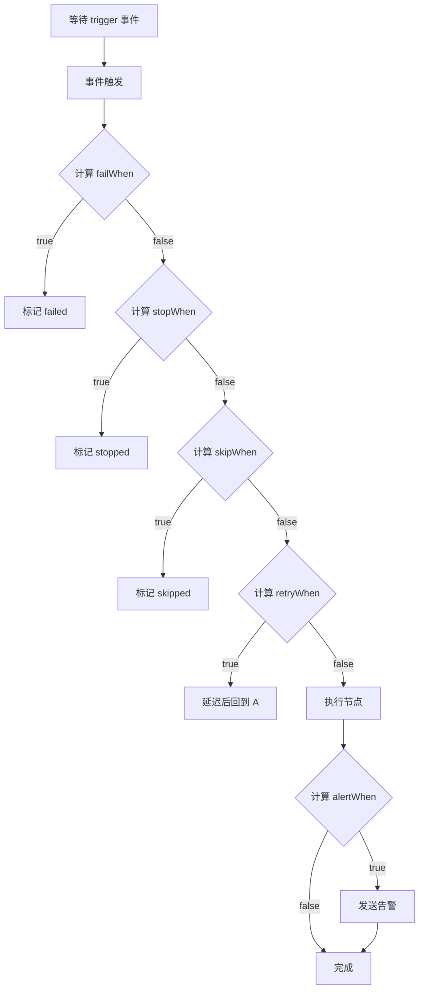

# 表达式语法（Expression Syntax）

## 1. 概述

本文档定义数据流平台中使用的**表达式语法规范**。关于事件系统的架构和执行机制，请参考 [Event.md](./Event.md)。

### 表达式类型

数据流引擎使用两种类型的表达式：

- **事件表达式**（Event Expression）：用于 `startWhen` 和 `stopWhen`，定义**何时检查**节点
- **状态表达式**（State Expression）：用于 `retryWhen`、`alertWhen`，定义**检查什么条件**

### 核心区别

| 类型 | 语法 | 引用对象 | 使用场景 |
|------|------|----------|----------|
| **事件表达式** | `event:`, `cron:`, `&&`, `\|\|`, `!` | 事件名称 | 定义检查时机 |
| **状态表达式** | Jinja2 `{{ }}` | 变量、状态 | 定义检查条件 |

---

## 2. 事件表达式（Event Expression）

### 2.1 语法规范

```ebnf
event_expression ::=
  | event_ref
  | cron_ref
  | event_expression "&&" event_expression
  | event_expression "||" event_expression
  | "!" event_expression
  | "(" event_expression ")"

event_ref ::= "event:" <nodeAlias> "." <eventName>
cron_ref  ::= "cron:" <cron_pattern> | "cron:@startup"
```

### 2.2 事件引用（event_ref）

#### 语法

```yaml
event:<nodeAlias>.<eventName>
```

- **nodeAlias**：上游节点的别名（在同一 Pipeline 中定义）
- **eventName**：节点发布的事件名称（由节点类型和执行模式决定）

#### 批处理任务的事件

```yaml
# Batch Task 的生命周期事件
event:extract.started      # 任务开始执行
event:extract.succeeded    # 任务执行成功
event:extract.failed       # 任务执行失败
event:extract.skipped      # 任务被跳过
event:extract.completed    # 任务完成（成功或失败）
```

**说明**：
- `succeeded`：任务成功完成，输出数据已就绪
- `failed`：任务执行失败，可能需要重试或告警
- `skipped`：任务因条件不满足被跳过
- `completed`：任务已结束，无论成功或失败

#### 流式服务的事件

```yaml
# Streaming Service 的生命周期事件
event:kafka_source.started         # 服务启动完成
event:kafka_source.stopped         # 服务已停止
event:kafka_source.statusChanged   # 状态变化（健康检查等导致）
```

**状态访问**：
```yaml
# 运行状态
kafka_source.status: starting | running | degraded | stopped

# 健康状态（由 healthCheck 周期性更新）
kafka_source.health: healthy | unhealthy
```

**说明**：

**生命周期事件**：
- `started`：服务启动完成（初始化完成，开始提供服务）
- `stopped`：服务已停止（主动停止或异常退出）

**状态变化事件**：
- `statusChanged`：运行状态或健康状态变化时触发
  - 健康检查导致 `health` 变化时触发
  - 服务降级导致 `status` 变化时触发
  - 可反复触发（如 healthy ↔ unhealthy）

**状态字段**：
- `status`：运行状态（starting | running | degraded | stopped）
- `health`：健康状态（healthy | unhealthy）
- 两者独立，可通过状态表达式访问

**典型使用场景**：
```yaml
# 等待服务启动
startWhen: "event:kafka_source.started"

# 等待服务健康（可能需要多次状态变化）
startWhen: "event:kafka_source.statusChanged"
skipWhen: "kafka_source.health != 'healthy'"

# 服务不健康时停止下游
stopWhen: "kafka_source.health == 'unhealthy'"
```

**扩展性**：流式服务可以根据具体实现定义更多事件，例如：

```yaml
# Kafka 连接器的扩展事件
event:kafka_source.partitionRebalanced    # 分区重平衡
event:kafka_source.lagExceeded            # 消费延迟超过阈值
event:kafka_source.checkpointCompleted    # Checkpoint 完成

# Flink Job 的扩展事件
event:flink_job.checkpointFailed          # Checkpoint 失败
event:flink_job.backpressureDetected      # 检测到反压
event:flink_job.resourceScaled            # 资源自动伸缩

# 数据库连接池的扩展事件
event:db_pool.connectionLimitReached      # 连接数达到上限
event:db_pool.queryTimeout                # 查询超时
```

这些扩展事件由具体的 TaskDefinition 实现定义，在对接实际服务时可以根据需要添加。

#### 外部事件

```yaml
# 外部系统回调触发的事件
event:quality_check.approval_done    # 审核完成
event:quality_check.labeling_done    # 标注完成
```

**说明**：
- 外部事件由 TaskDefinition 的 `externalEvents` 声明
- 系统提供回调 API，外部系统调用后触发事件

### 2.3 时钟事件（cron_ref）

#### 语法

```yaml
cron:<cron_pattern>
cron:@startup
```

- **cron_pattern**：标准的 cron 表达式（5 字段）
- **@startup**：特殊标记，在 Pipeline 启动时触发

#### 示例

```yaml
# 每天凌晨 2 点触发
startWhen: "cron:0 2 * * *"

# 每小时触发
startWhen: "cron:0 * * * *"

# 每周一早上 9 点触发
startWhen: "cron:0 9 * * 1"

# 启动时立即触发（用于流式任务）
startWhen: "cron:@startup"
```

### 2.4 逻辑运算符

#### AND（&&）：所有事件都发生

```yaml
# 等待多个上游任务都成功
startWhen: "event:user_features.succeeded && event:item_features.succeeded"

# 定时触发 + 依赖检查
startWhen: "cron:0 2 * * * && event:partition_checker.succeeded"
```

#### OR（||）：任一事件发生

```yaml
# 任一上游成功即可
startWhen: "event:source_a.succeeded || event:source_b.succeeded"

# 任一分支完成
startWhen: "event:route_approved.completed || event:route_rejected.completed"
```

#### NOT（!）：事件未发生

```yaml
# 上游未失败（包括成功或跳过）
startWhen: "!event:upstream.failed"
```

#### 分组（()）：控制优先级

```yaml
# 复杂逻辑组合
startWhen: "(event:a.succeeded || event:b.succeeded) && event:c.succeeded"
```

**运算符优先级**：`!` > `&&` > `||`

### 2.5 完整示例

```yaml
# 示例 1：简单依赖
- alias: "transform"
  startWhen: "event:extract.succeeded"

# 示例 2：多依赖汇聚
- alias: "merge"
  startWhen: "event:user_features.succeeded && event:item_features.succeeded"

# 示例 3：定时触发
- alias: "daily_job"
  startWhen: "cron:0 2 * * *"

# 示例 4：流式启动依赖
- alias: "deduplicate"
  executionMode: "streaming"
  startWhen: "event:kafka_source.statusChanged"
  skipWhen: "kafka_source.health != 'healthy'"
  stopWhen: "kafka_source.health == 'unhealthy'"

# 示例 5：外部事件
- alias: "process_approved"
  startWhen: "event:audit.approval_done"
  skipWhen: "audit.approval_done.status != 'approved'"

# 示例 6：可选依赖（任一成功）
- alias: "final_merge"
  startWhen: "event:route_a.completed || event:route_b.completed"
```

---

## 3. 状态表达式（State Expression）

### 3.1 模板引擎

状态表达式使用 **Jinja2** 模板引擎语法，表达式需包裹在 `{{ }}` 中。

**参考文档**：
- [Jinja2 官方文档](https://jinja.palletsprojects.com/)
- [Jinja2 表达式语法](https://jinja.palletsprojects.com/en/3.1.x/templates/#expressions)

### 3.2 语法规范

```yaml
# 基本格式
condition: "{{ <jinja2_expression> }}"

# Jinja2 支持的运算符
# 比较运算符：==, !=, >, <, >=, <=
# 逻辑运算符：and, or, not
# 成员运算符：in, not in
# 函数调用：function_name(args)
```

### 3.2 状态引用（state_ref）

#### 基本语法

```yaml
# Jinja2 变量访问
{{ nodeAlias.statePath }}

# 示例
{{ extract.output.row_count }}
{{ kafka_source.health }}
```

- **nodeAlias**：节点别名
- **statePath**：状态路径，支持嵌套访问（使用点号 `.` 分隔）

#### 批处理任务的输出变量

```yaml
# 访问任务的输出变量
extract.output.row_count          # 输出的行数
extract.output.file_path          # 输出文件路径
extract.output.quality_score      # 数据质量分数
extract.output.status             # 执行状态（partial/complete）
```

**说明**：
- `output` 是 TaskExecution 的输出结果
- 具体字段由 TaskDefinition 的 `outputVariables` 定义

#### 流式服务的指标

```yaml
# 访问流式任务的运行时指标
kafka_source.health               # 健康状态（healthy/unhealthy）
deduplicate.metrics.lag           # 消费延迟
deduplicate.metrics.throughput    # 吞吐量
```

#### 外部事件的 Payload

```yaml
# 访问外部事件的数据
quality_check.approval_done.status      # approved / rejected
quality_check.approval_done.reviewer    # 审核人
quality_check.approval_done.comment     # 审核意见
```

#### 系统内置变量

```yaml
retry_count              # 当前节点的重试次数
execution_date           # Pipeline 的执行日期（定时调度时）
```

### 3.4 比较运算符

```yaml
# 等于 / 不等于
failWhen: "{{ upstream.output.status == 'success' }}"
skipWhen: "{{ upstream.output.status != 'partial' }}"

# 大于 / 小于
failWhen: "{{ extract.output.row_count > 0 }}"
alertWhen: "{{ quality_score >= 0.95 }}"
failWhen: "{{ error_count < 10 }}"

# 包含 / 不包含（Jinja2 使用 in 运算符）
skipWhen: "{{ decision.output.route in ['A', 'B'] }}"
failWhen: "{{ file_format not in ['csv', 'json'] }}"
```

### 3.5 内置函数

内置函数通过 Jinja2 的自定义函数机制注册到执行环境中。

#### partition_exists()

检查 Hive/Iceberg 分区是否存在。

```yaml
# 语法
partition_exists(table_name, partition_value)

# 示例（Jinja2 使用 not 而不是 !）
retryWhen: "{{ not partition_exists(input_table, execution_date) }}"
```

#### is_empty()

检查表或路径是否为空。

```yaml
# 语法
is_empty(table_or_path)

# 示例
skipWhen: "{{ is_empty(upstream.output.path) }}"
```

#### count_rows()

统计表的行数。

```yaml
# 语法
count_rows(table_name)

# 示例
failWhen: "{{ count_rows(upstream.output.table) == 0 }}"
```

**扩展性**：根据具体的 TaskDefinition 类型（如表参数），可以提供更多内置函数。

### 3.6 逻辑运算符

Jinja2 使用 `and`、`or`、`not` 作为逻辑运算符，支持括号 `()` 控制优先级。

```yaml
# 复杂条件（Jinja2 使用 or 和 and）
failWhen: "{{ upstream.output.row_count == 0 or upstream.output.quality_score < 0.5 }}"
skipWhen: "{{ decision.output.route != 'A' and decision.output.route != 'B' }}"

# 使用 not（而不是 !）
retryWhen: "{{ not partition_exists(input_table, execution_date) }}"

# 使用括号控制优先级
failWhen: "{{ (status == 'failed' or status == 'error') and retry_count < 3 }}"
```

### 3.7 条件行为完整示例

```yaml
# 示例 1：数据验证
- alias: "merge"
  startWhen: "event:user_features.succeeded && event:item_features.succeeded"
  failWhen: "{{ user_features.output.row_count == 0 or item_features.output.row_count == 0 }}"
  alertWhen: "{{ merge.output.row_count < 1000 }}"

# 示例 2：条件路由
- alias: "route_a"
  startWhen: "event:decision.completed"
  skipWhen: "{{ decision.output.route != 'A' }}"

# 示例 3：等待外部系统
- alias: "extract"
  startWhen: "cron:0 2 * * *"
  retryWhen: "{{ not partition_exists(input_table, execution_date) }}"
  failWhen: "{{ retry_count >= 3 }}"

# 示例 4：审核工作流
- alias: "process_approved"
  startWhen: "event:audit.approval_done"
  skipWhen: "{{ audit.approval_done.status != 'approved' }}"
  alertWhen: "{{ audit.approval_done.comment == '' }}"
```

---

## 4. 执行逻辑

**注意**：本节描述条件表达式的执行逻辑。关于事件系统的架构、订阅管理和触发机制，请参考 [Event.md](./Event.md)。

### 4.1 条件检查顺序



### 4.2 条件优先级

```yaml
retryWhen > alertWhen
```

**说明**：

- `retryWhen` 在任务失败后检查，决定是否重试
- `alertWhen` 不影响执行状态，在节点完成后检查
- `startWhen` 和 `stopWhen` 是事件表达式，不是条件，定义检查时机

### 4.3 状态表达式的计算时机

**关键原则**：状态表达式**在特定时机检查**，不需要事件触发。

| 表达式 | 检查时机 |
|---------|----------|
| `retryWhen` | 任务失败后自动检查 |
| `alertWhen` | 任务完成后自动检查（批处理）或周期性检查（流式） |

#### 批处理任务

```yaml
- alias: "extract"
  startWhen: "cron:0 2 * * *"
  retryWhen: "{{ not partition_exists(input_table, execution_date) }}"
  alertWhen: "{{ extract.output.row_count < 1000 }}"
```

**执行流程**：

1. 引擎订阅 cron 事件
2. 每天凌晨 2 点触发 → 启动 extract 任务
3. 任务执行失败 → 检查 `retryWhen`
   - 如果分区不存在 → 等待后重试
   - 如果分区存在 → 标记最终失败
4. 任务完成 → 检查 `alertWhen`
   - 如果数据量 < 1000 → 发送告警

#### 流式任务

```yaml
- alias: "kafka_consumer"
  executionMode: "streaming"
  startWhen: "event:kafka_source.started"
  stopWhen: "event:kafka_source.stopped"
  alertWhen: "{{ kafka_consumer.metrics.lag > 10000 }}"
```

**执行流程**：

1. 引擎订阅 `kafka_source.started` 事件
2. 事件触发 → 启动 `kafka_consumer` 服务
3. 启动后，引擎订阅 `kafka_source.stopped` 事件
4. 收到停止事件 → 停止服务
5. 运行中周期性检查 `alertWhen` → 如果 lag > 10000，发送告警

**关键点**：

- `startWhen` 和 `stopWhen` 监听不同的事件
- 节点启动后移除 `startWhen` 订阅，添加 `stopWhen` 订阅
- 详细的订阅管理机制参考 [Event.md](./Event.md)

---

## 5. 最佳实践

### 5.1 事件表达式

**✅ 推荐**：
```yaml
# 明确事件类型
startWhen: "event:upstream.succeeded"

# 等待所有上游完成
startWhen: "event:node_a.succeeded && event:node_b.succeeded"

# 定时 + 依赖
startWhen: "cron:0 2 * * * && event:checker.succeeded"
```

**❌ 避免**：
```yaml
# 不要在 trigger 中引用状态
startWhen: "event:upstream.succeeded && upstream.output.row_count > 0"  # 错误！
```

### 5.2 状态表达式

**✅ 推荐**：

```yaml
# 数据验证（使用 Jinja2 语法）
failWhen: "{{ upstream.output.row_count == 0 }}"

# 条件路由
skipWhen: "{{ decision.output.route != 'A' }}"

# 使用内置函数（Jinja2 使用 not 而不是 !）
retryWhen: "{{ not partition_exists(input_table, execution_date) }}"

# 复杂逻辑（使用 and/or）
failWhen: "{{ row_count == 0 or quality_score < 0.5 }}"
```

**❌ 避免**：

```yaml
# 不要在状态表达式中引用事件
failWhen: "{{ event:upstream.failed }}"  # 错误！应该在 trigger 中处理

# 不要使用 && || ! （应使用 and or not）
failWhen: "{{ status == 'failed' && retry_count >= 3 }}"  # 错误！应使用 and
```

### 6.3 组合使用

**✅ 推荐**：

```yaml
# 混合表达式：事件 + 状态
- alias: "merge"
  startWhen: "event:extract.succeeded && {{ extract.output.row_count > 0 }}"  # 正确！
  alertWhen: "{{ merge.output.row_count < 1000 }}"

# 流式任务：不同的事件
- alias: "processor"
  executionMode: "streaming"
  startWhen: "event:source.started"
  stopWhen: "event:source.stopped"
```

**❌ 避免**：

```yaml
# 不要缺少事件触发
- alias: "merge"
  startWhen: "{{ extract.output.row_count > 0 }}"  # 错误！缺少事件
```

### 6.4 告警与执行分离

**✅ 推荐**：

```yaml
# 告警不影响执行
- alias: "merge"
  startWhen: "event:upstream.succeeded"
  alertWhen: "{{ merge.output.row_count < 1000 }}"  # 数据量低时告警，但不失败
```

**❌ 避免**：

```yaml
# 不要将告警条件用于失败判断
- alias: "merge"
  startWhen: "event:upstream.succeeded"
  retryWhen: "{{ merge.output.row_count < 1000 }}"  # 错误！应该用 alertWhen
```

---

## 7. 常见场景

### 7.1 批量特征工程

```yaml
- alias: "merge"
  startWhen: "event:user_features.succeeded && event:item_features.succeeded && {{ user_features.output.row_count > 0 }}"
  alertWhen: "{{ merge.output.row_count < 1000 }}"
```

### 7.2 增量数据处理

```yaml
- alias: "extract"
  startWhen: "cron:0 2 * * *"
  retryWhen: "{{ not partition_exists(input_table, execution_date) and retry_count < 3 }}"
  retryPolicy:
    maxAttempts: 3
    interval: 300
  alertWhen: "{{ retry_count >= 2 }}"
```

### 7.3 流式数据清洗

```yaml
- alias: "kafka_consumer"
  executionMode: "streaming"
  startWhen: "event:kafka_source.started"
  stopWhen: "event:kafka_source.stopped"
  alertWhen: "{{ kafka_consumer.metrics.lag > 10000 }}"
```

### 7.4 审批工作流

```yaml
# 审批节点（参考 TaskTypes/Approval.md）
- alias: "quality_check"
  taskType: "approval"
  startWhen: "event:upstream.succeeded"
  approvalConfig:
    approvers: ["reviewer@example.com"]
    timeout: 86400

# 审批通过分支
- alias: "process_approved"
  startWhen: "event:quality_check.approved"

# 审批拒绝分支
- alias: "process_rejected"
  startWhen: "event:quality_check.rejected"
```

---

## 8. 与其他概念的关系

### 8.1 与 VariableReference 的关系

- **VariableReference**：定义节点的**输入参数**如何获取（如 `{{upstream.output.path}}`）
- **Expression**：定义节点的**触发条件和行为**（如 `event:upstream.succeeded`）

两者使用不同的语法和上下文，互不冲突。

### 8.2 与 TaskDefinition 的关系

- **TaskDefinition**：声明任务的输入/输出变量、外部事件
- **Expression**：在 Node 中引用这些变量和事件

示例：

```yaml
# TaskDefinition 声明输出
TaskDefinition:
  outputVariables:
    - name: row_count
      type: number

# Node 引用输出（使用 Jinja2 语法）
Node:
  startWhen: "event:extract.succeeded"
  alertWhen: "{{ extract.output.row_count < 1000 }}"  # 引用输出变量
```

### 8.3 与 Event System 的关系

- **Expression**：定义语法规范（本文档）
- **Event System**：定义架构和执行机制（请参考 [Event.md](./Event.md)）

**分工**：

- Expression.md：定义**如何书写**表达式
- Event.md：定义**如何执行**表达式


---

## 9. 扩展性

### 9.1 自定义函数

未来可以支持用户定义的函数：

```yaml
alertWhen: "{{ custom_validate(upstream.output.data) }}"
```

### 9.2 自定义事件

TaskDefinition 可以声明自定义事件：

```yaml
TaskDefinition:
  externalEvents:
    - name: data_quality_check_done
      schema:
        score: number
        pass: boolean
```

### 9.3 事件过滤器

支持更复杂的事件过滤：

```yaml
startWhen: "event:upstream.succeeded[{{ output.row_count > 1000 }}]"
```

---

## 10. 总结

| 概念 | 语法 | 使用场景 | 作用 |
|------|------|----------|------|
| **事件表达式** | `event:`, `cron:`, `&&`, `\|\|`, `!` | `startWhen`, `stopWhen` | 定义检查时机 |
| **状态表达式** | Jinja2 `{{ }}` | `retryWhen`, `alertWhen` | 定义检查条件 |

**核心原则**：

- **事件驱动**：所有检查都由事件触发，不进行轮询
- **状态条件**：状态表达式在特定时机检查（失败/完成）
- **混合表达式**：支持在同一表达式中组合事件和状态
- **详细机制**：参考 [Event.md](./Event.md) 了解事件系统架构

