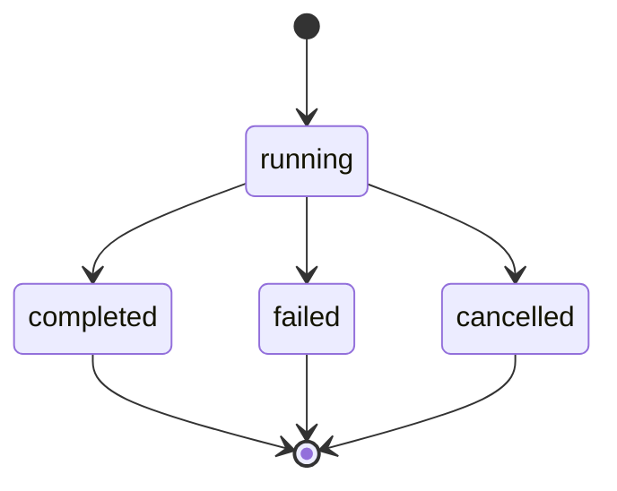

# PipelineExecution（流水线执行）

## 概述

**PipelineExecution（流水线执行）** 是 PipelineDefinition 的运行时实例，记录流水线的执行过程、状态变化和结果数据。每次启动流水线都会创建一个新的 PipelineExecution 聚合根。

### 核心职责

1. **执行追踪**：记录流水线每次执行的完整过程
2. **状态管理**：维护流水线及各节点的执行状态
3. **事件驱动调度**：根据节点的 `xxxWhen` 表达式订阅和响应事件
4. **变量上下文**：管理流水线输入变量和节点输出变量的值
5. **执行历史**：保留完整的执行记录供审计和分析

## 数据结构

```yaml
PipelineExecution:
  # 唯一标识
  id: string                           # 执行实例 ID，全局唯一（如 "exec_20250115_001"）
  
  # 定义引用
  pipelineId: string                   # 引用的 PipelineDefinition.id
  version: string                      # 引用的版本号（如 "1.0.0"）
  
  # 执行状态
  status: enum                         # "running" | "completed" | "failed" | "cancelled"
  
  # 输入变量实例
  inputVariables: Map[string, any]     # Pipeline 输入参数的实际值
    # 例如: { "data_source": "s3://bucket/data", "start_date": "2025-01-15" }
  
  # 节点执行记录
  nodeExecutions: Map[string, NodeExecution]
    # key: node.id（节点 ID）
    # value: NodeExecution（节点执行记录）
    NodeExecution:
      nodeId: string                   # 节点 ID（对应 PipelineDefinition.nodes[].id）
      type: enum                       # "task" | "pipeline"
      status: enum                     # "pending" | "running" | "completed" | "failed" | "skipped" | "cancelled"
      
      # 子任务/子流水线执行 ID
      executionId: string?             # 引用 TaskExecution.id 或子 PipelineExecution.id
      
      # 输入输出
      resolvedInputs: Map[string, any] # 解析后的输入变量值
      outputs: Map[string, any]        # 节点的输出变量（任务完成后填充）
      
      # 事件订阅
      subscribedEvents: List[EventSubscription]
        EventSubscription:
          expression: string           # 原始表达式（如 "event:node_a.completed"）
          eventPattern: string         # 事件模式（如 "node_a.completed"）
          mode: enum                   # "once" | "repeat"
          active: boolean              # 订阅是否仍然活跃
      
      # 时间戳
      startedAt: timestamp?
      completedAt: timestamp?
  
  # 执行上下文
  variableContext: Map[string, any]    # 所有变量的当前值（用于表达式求值）
    # 包含：
    # - pipeline.input.*: Pipeline 输入变量
    # - <node_id>.*: 各节点的输出变量
  
  # 事件历史
  eventHistory: List[ExecutionEvent]
    ExecutionEvent:
      eventId: string
      eventType: string                # 如 "node_a.completed", "pipeline.started"
      timestamp: timestamp
      source: string                   # 事件源（节点 ID 或 "pipeline"）
      payload: object                  # 事件负载
  
  # 元数据
  metadata:
    createdAt: timestamp               # 执行创建时间
    createdBy: string                  # 执行发起者
    startedAt: timestamp?              # 执行开始时间
    completedAt: timestamp?            # 执行完成时间
    tags: List[string]                 # 标签
```

## 状态机



**流水线状态转换说明**：

- `[*] → running`：启动执行（创建+启动），发布 pipeline.started 事件
- `running → completed`：所有节点成功
- `running → failed`：任一节点失败
- `running → cancelled`：用户取消

**节点执行状态**：

- `pending`：等待触发（仅用于内部节点，由 Pipeline 创建）
- `running`：正在执行
- `completed`：执行成功
- `failed`：执行失败
- `skipped`：被跳过
- `cancelled`：被取消

**说明**：pending 状态仅用于 Pipeline 内部的节点，由 PipelineExecution 创建时初始化。用户直接启动的 Task 或 Pipeline 不经过 pending 状态。

## 执行流程

### 1. 启动执行（创建+启动，一步到位）

```yaml
# 用户请求
POST /api/v1/pipelines/{pipelineId}/start
{
  "version": "1.0.0",
  "inputVariables": {
    "data_source": "s3://bucket/data",
    "start_date": "2025-01-15"
  }
}

# 系统行为
1. 验证 PipelineDefinition 存在且已发布
2. 验证 inputVariables 满足定义要求
3. 创建 PipelineExecution 实例，status = "running"
4. 初始化所有 NodeExecution，status = "pending"
5. 为每个节点注册事件订阅（根据 startWhen 等表达式）
6. 发布 "pipeline.started" 事件
7. 事件总线通知所有订阅者
8. 订阅了 "pipeline.started" 的节点开始执行
9. 返回 executionId
```

### 2. 节点执行循环

```yaml
# 当节点的 startWhen 表达式满足时
1. 解析节点的 inputBindings
   - 从 variableContext 中获取变量值
   - 替换表达式中的变量引用
   - 生成 resolvedInputs

2. 创建子执行（TaskExecution 或子 PipelineExecution）
   - NodeExecution.executionId 记录子执行 ID
   - NodeExecution.status = "running"
   - NodeExecution.startedAt = 当前时间

3. 等待子执行完成
   - 监听子执行的事件（task.completed, task.failed 等）

4. 处理执行结果
   成功情况:
     - NodeExecution.status = "completed"
     - NodeExecution.outputs = 子执行的输出
     - 更新 variableContext，添加节点输出变量
     - 发布 "{node_id}.completed" 事件
     - 检查 alertWhen 条件，如满足则发送告警
   
   失败情况:
     - NodeExecution.status = "failed"
     - NodeExecution.outputs = 子执行的错误输出变量
     - 发布 "{node_id}.failed" 事件
     - 检查 retryWhen 条件：
       * 如果满足，重新触发节点
       * 如果不满足，标记最终失败
     - 下游依赖该节点的节点标记为 "skipped"

5. NodeExecution.completedAt = 当前时间
```

### 3. 流水线完成判断

```yaml
# 持续检查流水线状态
检查条件:
  - 所有 NodeExecution 都不在 [pending, running] 状态

完成逻辑:
  如果所有节点都是 "completed":
    - PipelineExecution.status = "completed"
    - 发布 "pipeline.completed" 事件
  
  如果有任一节点是 "failed":
    - PipelineExecution.status = "failed"
    - 发布 "pipeline.failed" 事件
  
  如果有节点是 "cancelled":
    - PipelineExecution.status = "cancelled"
    - 发布 "pipeline.cancelled" 事件

完成时间:
  - PipelineExecution.metadata.completedAt = 当前时间
```

## 事件订阅机制

### 订阅注册

```yaml
# 在 PipelineExecution 创建时注册订阅
对于每个节点:
  解析 startWhen 表达式:
    - 提取所有 event: 引用
    - 提取所有 cron: 引用
    - 创建 EventSubscription 记录
  
  注册到事件总线:
    - 订阅模式：startMode（once/repeat）
    - 回调：触发节点执行逻辑

示例:
  节点配置:
    startWhen: "event:node_a.completed && event:node_b.completed"
    startMode: "once"
  
  注册订阅:
    - subscribe("node_a.completed", mode="once")
    - subscribe("node_b.completed", mode="once")
  
  触发条件:
    当两个事件都到达时，评估完整表达式
    如果表达式为 true，触发节点执行
```

### 订阅取消

```yaml
once 模式:
  - 事件触发并启动节点后自动取消订阅
  - EventSubscription.active = false

repeat 模式:
  - 保持订阅活跃，持续响应事件
  - 直到流水线完成或被取消

手动取消:
  - 用户取消流水线执行时，取消所有活跃订阅
```

## 变量上下文管理

```yaml
variableContext 结构:
  pipeline:
    input:
      data_source: "s3://bucket/data"
      start_date: "2025-01-15"
  
  extract_data:
    output_path: "s3://bucket/output/extract"
    row_count: 1000000
  
  transform_data:
    output_path: "s3://bucket/output/transform"
    quality_score: 0.95

变量解析:
  表达式: "{{ extract_data.output_path }}"
  解析为: "s3://bucket/output/extract"
  
  表达式: "{{ extract_data.row_count + 100 }}"
  解析为: 1000100

更新时机:
  - Pipeline 创建时：初始化 pipeline.input.*
  - 节点完成时：添加 <node_id>.* 输出变量
  - 用于后续节点的 inputBindings 解析
```

## 业务规则

### 节点跳过规则

```yaml
节点被跳过的情况:
  1. 上游依赖失败
     - 如果 startWhen 引用的任一节点 failed
     - 该节点 status = "skipped"
     - skipReason = "upstream_failed: node_x"
  
  2. 条件不满足
     - 如果 startWhen 表达式求值为 false
     - 该节点 status = "skipped"
     - skipReason = "condition_not_met"
  
  3. 流水线被取消
     - 如果用户取消流水线
     - 所有 pending 节点 status = "skipped"
     - skipReason = "pipeline_cancelled"

示例:
  nodes:
    - id: extract
      startWhen: "event:pipeline.started"
    
    - id: transform
      startWhen: "event:extract.completed"
    
    - id: conditional_load
      startWhen: "event:transform.completed && {{ transform.quality_score > 0.9 }}"
  
  执行场景 1: extract 失败
    - extract.status = "failed"
    - transform.status = "skipped" (upstream_failed: extract)
    - conditional_load.status = "skipped" (upstream_failed: transform)
  
  执行场景 2: transform 成功但 quality_score = 0.8
    - extract.status = "completed"
    - transform.status = "completed"
    - conditional_load.status = "skipped" (condition_not_met)
```

### 流水线完成条件

```yaml
流水线 completed 的条件:
  - 所有节点都是 "completed" 或 "skipped"
  - 至少有一个节点是 "completed"

流水线 failed 的条件:
  - 有任一关键节点 "failed"
  - 所有节点都是 "skipped"（没有任何节点成功执行）

流水线 cancelled 的条件:
  - 用户主动取消
  - 所有 running 节点被终止
```

## 与其他概念的关系

```plaintext
PipelineDefinition           PipelineExecution
       │                            │
       │ creates                    │
       │                            │
       ├──────────────────────────► │
       │                            │
       │                            ├─── nodeExecutions
       │                            │       │
nodes  │                            │       ├─► NodeExecution (task)
  │    │                            │       │      │
  │    │                            │       │      └─ references ─► TaskExecution
  │    │                            │       │
  │    │                            │       └─► NodeExecution (pipeline)
  ▼    │                            │              │
TaskDefinition                      │              └─ references ─► PipelineExecution (子流水线)
       │                            │
       │                            ├─── variableContext
       │                            │      - pipeline.input.*
       │                            │      - <node_id>.* (outputs)
       │                            │
       │                            ├─── eventHistory
       │                            │      - pipeline.started
       │                            │      - node.completed/failed
       │                            │
       │                            └─── metadata
       │                                   - createdAt, completedAt
       │                                   - createdBy
       └────────────────────────────────────────────────────────────

关键关系:
1. PipelineExecution 引用 PipelineDefinition 的 id 和 version
2. 每个 NodeExecution 对应 PipelineDefinition.nodes 中的一个节点
3. NodeExecution.executionId 引用具体的任务或子流水线执行
4. variableContext 存储所有变量的运行时值
5. eventHistory 记录完整的事件序列
```

## API 示例

### 启动执行

```http
POST /api/v1/pipelines/{pipelineId}/start
Content-Type: application/json

{
  "version": "1.0.0",
  "inputVariables": {
    "data_source": "s3://bucket/data",
    "start_date": "2025-01-15",
    "quality_threshold": 0.9
  },
  "tags": ["daily-batch", "production"]
}

# 响应（创建并启动，一步到位）
{
  "executionId": "exec_20250115_001",
  "pipelineId": "com.company.pipelines:data_etl",
  "version": "1.0.0",
  "status": "running",
  "createdAt": "2025-01-15T10:00:00Z",
  "startedAt": "2025-01-15T10:00:00Z",
  "createdBy": "alice@company.com"
}
```

### 查询执行状态

```http
GET /api/v1/executions/{executionId}

# 响应
{
  "executionId": "exec_20250115_001",
  "pipelineId": "com.company.pipelines:data_etl",
  "version": "1.0.0",
  "status": "running",
  "inputVariables": {
    "data_source": "s3://bucket/data",
    "start_date": "2025-01-15"
  },
  "nodeExecutions": {
    "extract_data": {
      "nodeId": "extract_data",
      "type": "task",
      "status": "completed",
      "executionId": "task_exec_001",
      "outputs": {
        "output_path": "s3://bucket/output/extract",
        "row_count": 1000000
      },
      "startedAt": "2025-01-15T10:00:05Z",
      "completedAt": "2025-01-15T10:05:30Z"
    },
    "transform_data": {
      "nodeId": "transform_data",
      "type": "task",
      "status": "running",
      "executionId": "task_exec_002",
      "startedAt": "2025-01-15T10:05:35Z"
    },
    "load_data": {
      "nodeId": "load_data",
      "type": "task",
      "status": "pending"
    }
  },
  "variableContext": {
    "pipeline": {
      "input": {
        "data_source": "s3://bucket/data",
        "start_date": "2025-01-15"
      }
    },
    "extract_data": {
      "output_path": "s3://bucket/output/extract",
      "row_count": 1000000
    }
  },
  "metadata": {
    "createdAt": "2025-01-15T10:00:00Z",
    "createdBy": "alice@company.com",
    "startedAt": "2025-01-15T10:00:05Z"
  }
}
```

### 取消执行

```http
POST /api/v1/executions/{executionId}/cancel

# 响应
{
  "executionId": "exec_20250115_001",
  "status": "cancelled",
  "completedAt": "2025-01-15T10:10:00Z"
}
```

### 查询执行历史

```http
GET /api/v1/pipelines/{pipelineId}/executions?status=completed&limit=20&offset=0

# 响应
{
  "executions": [
    {
      "executionId": "exec_20250115_001",
      "version": "1.0.0",
      "status": "completed",
      "createdAt": "2025-01-15T10:00:00Z",
      "completedAt": "2025-01-15T10:15:30Z",
      "duration": 930
    },
    {
      "executionId": "exec_20250114_001",
      "version": "1.0.0",
      "status": "failed",
      "createdAt": "2025-01-14T10:00:00Z",
      "completedAt": "2025-01-14T10:08:15Z",
      "duration": 495
    }
  ],
  "total": 42,
  "page": 1,
  "pageSize": 20
}
```
