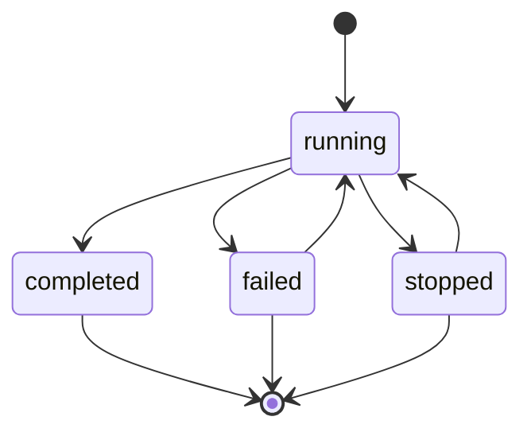

# TaskExecution（任务执行）

## 概述

**TaskExecution（任务执行）** 是 TaskDefinition 的运行时实例，记录单个任务的执行过程、状态和结果。每次执行任务都会创建一个新的 TaskExecution 聚合根。

### 核心职责

1. **状态追踪**：记录任务从启动到完成的状态变化
2. **输入输出管理**：保存任务的实际输入参数和产生的输出结果
3. **生命周期管理**：支持任务的启动、停止、重试等操作
4. **事件发布**：在状态变化时发布相应的事件

## 数据结构

```yaml
TaskExecution:
  # 唯一标识
  id: string                           # 执行实例 ID，全局唯一（如 "task_exec_001"）
  
  # 定义引用
  taskNamespace: string                # 任务命名空间
  taskName: string                     # 任务名称
  taskVersion: string                  # 任务版本号
  
  # 执行状态
  status: enum                         # "running" | "completed" | "failed" | "stopped"
  
  # 输入输出
  inputs: Map[string, any]             # 实际解析的输入变量值
  outputs: Map[string, any]?           # 任务输出变量
    # - completed 状态：包含任务定义的输出变量
    # - failed 状态：包含错误相关的输出变量（如 error_type, error_message, error_code）
  
  # 时间戳
  createdAt: timestamp                 # 创建时间
  startedAt: timestamp?                # 开始执行时间
  completedAt: timestamp?              # 完成时间
  
  # 元数据
  metadata:
    createdBy: string                  # 执行发起者
    tags: List[string]                 # 标签
    retryCount: number                 # 重试次数（默认 0）
```

## 状态机



**状态转换说明**：

- `[*] → running`：启动任务（创建+执行），发布 started 事件
- `running → completed`：执行成功，发布 completed 事件
- `running → failed`：执行失败，发布 failed 事件
- `running → stopped`：手动停止（仅流处理），发布 stopped 事件
- `failed → running`：重试，retryCount++
- `stopped → running`：重启（仅流处理），发布 restarted 事件

## 状态说明

| 状态 | 说明 | 允许的操作 |
|------|------|-----------|
| `running` | 任务正在执行 | stop（仅流处理） |
| `completed` | 任务执行成功 | 无（最终状态） |
| `failed` | 任务执行失败 | retry |
| `stopped` | 任务被停止 | restart（仅流处理） |

## 执行流程

### 批处理任务执行流程

```yaml
1. 启动任务（创建+执行，一步到位）
   - 验证 TaskDefinition 存在且已发布
   - 验证 inputs 满足 inputVariables 定义
   - 创建 TaskExecution，status = "running"
   - 发布 "{task_namespace}.{task_name}.started" 事件
   - 提交任务到执行引擎
   - 返回 executionId

2. 执行中
   - 执行引擎运行任务逻辑
   - 可选：发布进度事件

3. 执行完成
   成功情况:
     - status: running → completed
     - 从执行器获取输出结果
     - outputs = 任务输出变量
     - completedAt = 当前时间
     - 发布 "{task_namespace}.{task_name}.completed" 事件
     - 事件负载包含 outputs
   
   失败情况:
     - status: running → failed
     - outputs = 错误相关的输出变量（error_type, error_message, error_code 等）
     - completedAt = 当前时间
     - 发布 "{task_namespace}.{task_name}.failed" 事件
     - 事件负载包含错误信息
```

### 流处理任务执行流程

```yaml
1. 启动任务（创建+执行，一步到位）
   - 验证 TaskDefinition 存在且已发布
   - 验证 inputs 满足 inputVariables 定义
   - 创建 TaskExecution，status = "running"
   - 发布 "{task_namespace}.{task_name}.started" 事件
   - 启动流处理作业（如 Flink Job）
   - 流处理作业持续运行
   - 返回 executionId

2. 运行中管理
   停止操作:
     - 接收停止指令
     - 优雅关闭流处理作业
     - status: running → stopped
     - 发布 "{task_namespace}.{task_name}.stopped" 事件
   
   重启操作:
     - 从 stopped 状态重新启动
     - status: stopped → running
     - 发布 "{task_namespace}.{task_name}.restarted" 事件
     - 可选择从检查点恢复

4. 异常处理
   - 流处理作业异常退出
   - status: running → failed
   - 发布 "{task_namespace}.{task_name}.failed" 事件
```

### 审批任务执行流程

```yaml
1. 启动审批流程（创建+执行，一步到位）
   - 验证 TaskDefinition 存在且已发布
   - 验证 inputs 满足 inputVariables 定义
   - 创建 TaskExecution，status = "running"
   - 发布 "{task_namespace}.{task_name}.started" 事件
   - 发送审批请求到外部系统或内部审批服务
   - 生成 executionToken 供回调使用
   - 返回 executionId

2. 等待审批
   - 任务进入等待状态
   - 定期检查超时条件
   
   审批通过:
     - 外部系统回调 API
     - status: running → completed
     - outputs = { "approved": true, "approver": "alice", "comment": "..." }
     - 发布 "*.approved" 事件
   
   审批拒绝:
     - 外部系统回调 API
     - status: running → failed
     - outputs = { "rejected": true, "rejector": "bob", "reason": "..." }
     - 发布 "*.rejected" 事件
   
   超时:
     - 达到超时时间
     - status: running → failed
     - outputs = { "timeout": true, "timeout_duration": 3600 }
     - 发布 "*.timeout" 事件
```

## 事件发布

任务执行时根据类型和状态发布不同的事件：

### 批处理任务事件

| 事件名称 | 触发时机 | 事件负载 |
|---------|---------|---------|
| `{source}.started` | 任务开始执行 | `{ nodeId, taskDefinition, executionId }` |
| `{source}.completed` | 任务执行成功 | `{ nodeId, duration, outputs }` |
| `{source}.failed` | 任务执行失败 | `{ nodeId, error, attempts }` |

### 流处理任务事件

| 事件名称 | 触发时机 | 事件负载 |
|---------|---------|---------|
| `{source}.started` | 任务开始执行 | `{ nodeId, taskDefinition, executionId }` |
| `{source}.stopped` | 任务被停止 | `{ nodeId, reason }` |
| `{source}.restarted` | 任务被重启 | `{ nodeId, fromCheckpoint }` |
| `{source}.completed` | 任务正常结束 | `{ nodeId, duration, outputs }` |
| `{source}.failed` | 任务异常失败 | `{ nodeId, error, attempts }` |

### 审批任务事件

| 事件名称 | 触发时机 | 事件负载 |
|---------|---------|---------|
| `{source}.started` | 审批流程开始 | `{ nodeId, taskDefinition, executionId }` |
| `{source}.approved` | 审批通过 | `{ nodeId, approver, comment, approvedAt }` |
| `{source}.rejected` | 审批拒绝 | `{ nodeId, rejector, reason, rejectedAt }` |
| `{source}.timeout` | 审批超时 | `{ nodeId, timeoutDuration }` |

## 重试机制

```yaml
重试触发条件:
  - TaskExecution.status = "failed"
  - 流水线节点的 retryWhen 表达式求值为 true
  - retryCount < maxRetries（从 TaskDefinition 或 Node 配置）

重试行为:
  1. metadata.retryCount++
  2. status: failed → running
  3. 重新提交任务到执行引擎
  4. 发布 "{source}.started" 事件（携带 retryCount）

示例:
  节点配置:
    retryWhen: "event:transform.failed && {{ transform.retryCount < 3 }}"
  
  执行流程:
    第 1 次执行失败 → retryCount = 1 → 重试
    第 2 次执行失败 → retryCount = 2 → 重试
    第 3 次执行失败 → retryCount = 3 → 不再重试，标记最终失败
```

## 与 PipelineExecution 的关系

```plaintext
PipelineExecution
  │
  ├── nodeExecutions
  │     │
  │     ├── NodeExecution (extract_data)
  │     │     │
  │     │     ├── executionId ─────────► TaskExecution (task_exec_001)
  │     │     │                              │
  │     │     │                              ├── status: "completed"
  │     │     │                              ├── outputs: { ... }
  │     │     │                              └── events: started, completed
  │     │     │
  │     │     └── outputs: { ... }  # 从 TaskExecution.outputs 复制
  │     │
  │     ├── NodeExecution (transform_data)
  │     │     │
  │     │     └── executionId ─────────► TaskExecution (task_exec_002)
  │     │                                    └── status: "running"
  │     │
  │     └── NodeExecution (load_data)
  │           └── status: "pending" (尚未创建 TaskExecution)
  │
  └── variableContext
        ├── pipeline.input.*
        ├── extract_data.*  # 从 TaskExecution(task_exec_001).outputs 获取
        └── transform_data.* # 待 TaskExecution(task_exec_002) 完成后填充

关键点:
1. 每个 NodeExecution 对应一个 TaskExecution
2. NodeExecution.executionId 引用 TaskExecution.id（单向引用）
3. TaskExecution 的事件会触发 NodeExecution 的状态更新
4. TaskExecution 的 outputs 会复制到 PipelineExecution.variableContext
```

## 业务规则

### 输入验证

```yaml
resolvedInputs 必须满足:
  1. 包含 TaskDefinition.inputVariables 中所有 required=true 的变量
  2. 变量类型匹配定义
  3. 满足变量的验证规则（如范围、格式等）

验证失败:
  - 任务不会进入 running 状态
  - 立即标记为 failed
  - outputs 包含 error_type = "ValidationError"
```

### 输出保存

```yaml
outputs 保存条件:
  - completed 状态：保存 TaskDefinition 定义的输出变量
  - failed 状态：保存错误相关的输出变量
    * 标准错误变量：error_type, error_message, error_code
    * 任务特定的错误信息（如审批的 rejector, reason）
  - 缺失的可选输出变量填充 null

验证:
  - 验证输出变量名称和类型
  - 记录验证警告但不阻止完成
```

## API 示例

### 启动任务执行

```http
POST /api/v1/tasks/{namespace}:{name}/start
Content-Type: application/json

{
  "version": "1.0.0",
  "inputs": {
    "data_path": "s3://bucket/data/input.parquet",
    "quality_threshold": 0.9
  },
  "tags": ["test", "manual-run"]
}

# 响应（创建并启动，一步到位）
{
  "executionId": "task_exec_001",
  "taskNamespace": "com.company.tasks",
  "taskName": "data_quality_check",
  "taskVersion": "1.0.0",
  "status": "running",
  "createdAt": "2025-01-15T10:00:00Z",
  "startedAt": "2025-01-15T10:00:00Z",
  "createdBy": "alice@company.com"
}
```

### 查询任务执行状态

```http
GET /api/v1/task-executions/{executionId}

# 响应
{
  "executionId": "task_exec_001",
  "taskNamespace": "com.company.tasks",
  "taskName": "data_quality_check",
  "taskVersion": "1.0.0",
  "status": "completed",
  "inputs": {
    "data_path": "s3://bucket/data/input.parquet",
    "quality_threshold": 0.9
  },
  "outputs": {
    "quality_score": 0.95,
    "row_count": 1000000,
    "validation_errors": []
  },
  "createdAt": "2025-01-15T10:00:00Z",
  "startedAt": "2025-01-15T10:00:05Z",
  "completedAt": "2025-01-15T10:05:35Z",
  "metadata": {
    "createdBy": "alice@company.com",
    "tags": ["test", "manual-run"],
    "retryCount": 0
  }
}
```

### 停止流处理任务

```http
POST /api/v1/task-executions/{executionId}/stop

# 响应
{
  "executionId": "task_exec_002",
  "status": "stopped",
  "completedAt": "2025-01-15T10:10:00Z"
}
```

### 重启流处理任务

```http
POST /api/v1/task-executions/{executionId}/restart
Content-Type: application/json

{
  "fromCheckpoint": true
}

# 响应
{
  "executionId": "task_exec_002",
  "status": "running",
  "startedAt": "2025-01-15T10:12:00Z"
}
```

### 查询任务执行历史

```http
GET /api/v1/tasks/{namespace}:{name}/executions?status=completed&limit=20&offset=0

# 响应
{
  "executions": [
    {
      "executionId": "task_exec_001",
      "version": "1.0.0",
      "status": "completed",
      "createdAt": "2025-01-15T10:00:00Z",
      "duration": 330
    },
    {
      "executionId": "task_exec_000",
      "version": "1.0.0",
      "status": "failed",
      "createdAt": "2025-01-14T10:00:00Z",
      "duration": 120,
      "outputs": {
        "error_type": "DataValidationError",
        "error_message": "Invalid data format",
        "error_code": "DV_001"
      }
    }
  ],
  "total": 156,
  "page": 1,
  "pageSize": 20
}
```
